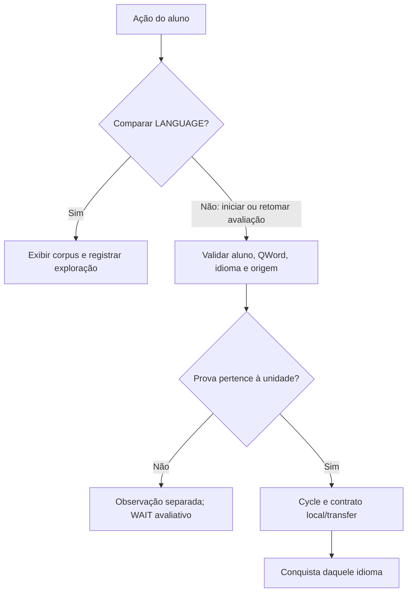

# Estudo Fino — avaliação independente por idioma

Data: 2026-10-02. Branch: `jaguar/verb-explorer-resume-live-wire`. Base auditada: `fa206b1d83388f234eb82d64fd157dd0212a1b59`.

Classificação desta passagem: DOCUMENTAÇÃO / ESTUDO FINO. Nenhum JS, CSS, HTML ou JSON de produção alterado. A proposta abaixo depende de homologação e GO executor próprios.

## O que já está fechado

LIVE-21 separa prova local (`mode: local`) e transferência (`mode: transfer`) para WHICH, WHAT e WHY. Os dois modos descrevem aplicação na Experience de origem e aplicação na Experience seguinte, respectivamente. Comparar EN/ES/PT não é transferência de Experience.

Percursos existentes: WHICH Shopping → Preparing; WHAT Shopping → Preparing ou Preparing → Having; WHY Having → After Dinner. Corpus e alternativas próprios dos três idiomas permanecem preservados. Esta auditoria não cria WHERE nem modifica Xespirito.

## Achados e impacto

| Elo e fonte | Comportamento atual comprovado | Ajuste proposto |
|---|---|---|
| LANGUAGE — `js/verb-explorer.js` | Muda `experienceLanguage` e renderiza novamente; não declara uma nova avaliação | Manter comparação livre. Distinguir idioma exibido de idioma da avaliação |
| Seleção — `verb-explorer-thinking-mind-assessment-selection.js` | Mesmo skill retorna a Session ativa sem conferir idioma; retenção usa `learnerId + skill` | Identificar a unidade por aluno, habilidade, idioma de avaliação e origem/circuito |
| Alvo anônimo pendente — mesmo arquivo | Guarda pergunta e Experience; não guarda idioma | Mapear idioma e validade do alvo. Evitar confirmar um alvo antigo após comparação de idiomas |
| Nascimento — `verb-explorer-adaptive-composer.js` | Contexto inicial inclui skill, Experience, contrato e evidências vazias; omite idioma | Capturar idioma validado no início explícito, sem inferi-lo posteriormente do destaque visual |
| Decision — `adaptive-pedagogical-orchestrator.js` | Caminho normal preserva skill; não estabelece idioma obrigatório da Session | Preservar o idioma declarado da avaliação no caminho canônico de criação |
| Eventos/provas WHICH — browser wire, Result, Evidence, Attempt | Algumas provas não transportam idioma. A escolha contextual guarda `experienceLanguage` no contexto; uso local e transferência não têm cadeia uniforme | Propagar idioma canônico de ponta a ponta; não usar idioma atual da tela como substituto de proveniência ausente |
| WHAT/WHY — respectivos Result/bridges/Attempt boundaries | Evento, Result e contexto da prova conferem idioma entre si | Acrescentar igualdade com a unidade da Session; concordância entre evento e prova não basta |
| Entrada — `verb-explorer-adaptive-coordinator.js`, `verb-explorer-transfer-attempt-authority.js` | Verificam skill, ocorrência, Experience e origem da transferência. Não impõem idioma da Session em todos os caminhos | Conferir escopo antes de submeter ao Cycle, em escolha, uso e transferência |
| Contrato — `green-pass-profile.js` | Avaliador genérico compara campos dos requisitos; os contratos atuais não limitam idioma nem aluno | Conservar o avaliador. Fornecer somente evidências pertencentes à unidade validada |
| Green estatístico — `green-pass-profile.js` | `skillKey` aceita idioma de Attempt, mas os caminhos canônicos nem sempre o fornecem no topo; existem defaults EN | Não confundir este perfil estatístico com fechamento contratual. Auditar compatibilidade antes de remover defaults genéricos |
| Fechamento — `adaptive-contract-closure-evidence-source.js` | Deduplicação usa skill + Experience. Idioma registrado vem do contexto, com fallback EN | Deduplicar por unidade e registrar idioma comprovado, sem fabricar EN |
| Histórico — `adaptive-observed-attempt-evidence-source.js`, `adaptive-evidence-view.js` | Parte das pegadas registra idioma; leitura de priorEvidence seleciona só skill | Preservar pegadas comparativas; separar evidência avaliativa por idioma |
| Projeção — `adaptive-learner-trail-view.js`, superfície da trilha e destaque Thinking Mind | Filtram por skill. Uma conquista EN pode ser apresentada enquanto a tela mostra ES/PT | Projetar conquista do idioma correspondente; comparação visual nunca cria conquista |
| Adoção — NextAssessmentTarget, NextSessionSource, NextSessionActivation | Recebe idioma da interface; nem todos os passos o estabilizam na Decision | Gesto explícito adota a unidade seguinte com idioma declarado; Green não navega automaticamente |
| Troca de aluno — LearnerIdentityProvider | Confirmação de outro nick limpa autoridades; abrir/cancelar editor preserva Session | Preservar regra homologada; testar que nenhum idioma de um aluno passa a outro |

A origem/circuito precisa ser distinguida porque WHAT pode começar em Shopping ou Preparing. Um cache apenas aluno + habilidade + idioma ainda poderia restaurar a Session da origem errada. Não se propõe substituir os IDs atuais das skills.

## Verificações isoladas executadas

Código lido diretamente da base auditada; verificações em cópias de trabalho, sem alterar testes de produção nesta passagem:

1. WHICH: função EN + uso local ES + transferência PT → avaliador retorna GREEN_PASS.
2. WHAT: mesma combinação entre idiomas → GREEN_PASS.
3. WHY: mesma combinação entre idiomas → GREEN_PASS.
4. Dois fechamentos de WHAT na mesma Experience, EN e depois ES → apenas um registro, por deduplicação sem idioma.
5. Trilha de WHAT com fechamento EN → GREEN_PASS_CONFIRMED; API não oferece filtro de idioma.
6. Session ativa de WHAT + tela ES + seleção explícita do mesmo skill → retorna true sem passar pelo provider nem conferir idioma.

Limite: os três primeiros resultados demonstram que o avaliador aceita o conjunto quando recebido. Não afirmam que o navegador emitiu essa combinação durante um teste do usuário. O último demonstra o caminho de reutilização com autoridades controladas, não um teste visual completo.

## Contrato candidato — ainda não implementado

Unidade avaliativa: `learnerId + skill + assessmentLanguage + originExperienceId`, com referência ao contrato utilizado. Os nomes dos campos são proposta, não uma API já estabilizada.

- `explorationLanguage`: idioma mostrado para comparar e explorar. Pode mudar livremente.
- `assessmentLanguage`: idioma validado da unidade explicitamente iniciada. Não muda pelo clique em LANGUAGE.
- Cada Evidence pertence à ocorrência, aluno, skill, idioma e circuito validados. Suporte e modos local/transfer continuam separados.
- Uma prova ES pode ser observada durante comparação, mas não completa um requisito EN.
- Escolher explicitamente iniciar/retomar a mesma QWord em ES pode recuperar sua unidade ES ou criar uma unidade vazia, se aquele ponto do corpus possuir início canônico.
- Se a página é uma visita/transferência, não transformar o clique em LANGUAGE ou QWord numa adoção silenciosa da Experience.
- Conquista EN permanece no histórico EN. Comparar ES não apaga EN nem ilumina ES como conquistado.
- Falta de idioma/proveniência, resposta atrasada de outra unidade ou alvo pendente incompatível mantém WAIT antes do Cycle.

O destino de um alvo anônimo pendente após troca de LANGUAGE precisa de homologação. Recomendação mínima: não reinterpretar o alvo anterior pelo idioma atual; invalidar sua elegibilidade de início e exigir nova escolha explícita da QWord no idioma desejado. O rastro exploratório continua disponível. Isso evita iniciar uma avaliação inesperada na confirmação do nick.

## Fluxo proposto

Esse fluxo não altera a autoridade de NEXT nem a adoção explícita de uma Session na Experience visitada.

## Compatibilidade e migração

Não reclassificar automaticamente o histórico antigo. Uma etiqueta EN no fechamento atual pode ter vindo de fallback; não comprova que todas as provas foram EN. Preservar os registros anteriores como histórico anterior à separação, sem transformá-los em três conquistas novas. Também não apagar evidências nem reabrir arbitrariamente conquistas históricas do usuário.

Escopo exato da apresentação desse legado deve ser homologado antes de implementação. Login, persistência entre dispositivos e contas Gmail continuam fora deste elo; nickname atual não equivale a autenticação.

Xespirito pode manter hipóteses comparativas e leitura de contexto. Isso não lhe atribui autoridade para emitir Green Pass, traduzir corpus ou transferir prova entre idiomas.

## Sequência mínima recomendada

1. Homologar unidade avaliativa e validade do alvo pendente após LANGUAGE.
2. Estabilizar idioma no nascimento/retenção e propagar proveniência WHICH/WHAT/WHY.
3. Conferir escopo antes do Cycle, fechamento e adoção. Reutilizar avaliador existente.
4. Separar projeção de conquistas e histórico por idioma; registrar política do legado.
5. Testar EN/ES/PT isoladamente, mistura rejeitada, retorno à unidade anterior, outro nick, resposta atrasada, ausência de idioma, suporte e transferência.
6. CI + deployment + homologação visual separados.
7. Depois retornar a WHERE em Preparing: corpus contextual e Dependency Focus próprios.

Não expandir outras QWords nem reformular layout durante esse lote contratual.
